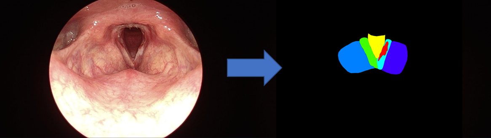

# LARYNX CANCER SEGMENTATION



---

## How to run

### 1. install requirements

```bash
$ pip install -r requirements.txt
```

### 2. preprocess your files

> xml to png mask

```bash
$ python pre_processing.py \                                 
--root_folder "path/to/your/unzipped/archive" \
--destination_folder "./data_processed"
```

### 3. run test scripts

> **Preprocessed**

```bash
$ python test.py --data_path "./data_processed/test_set_for_LCAI"
```

> **Original**

```bash
$ python test.py --data_path "path/to/your/unzipped/archive/test_set_for_LCAI"
```

---

## Classification Result


